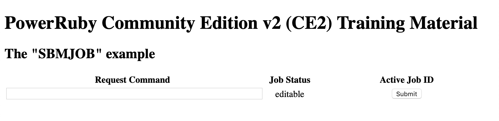
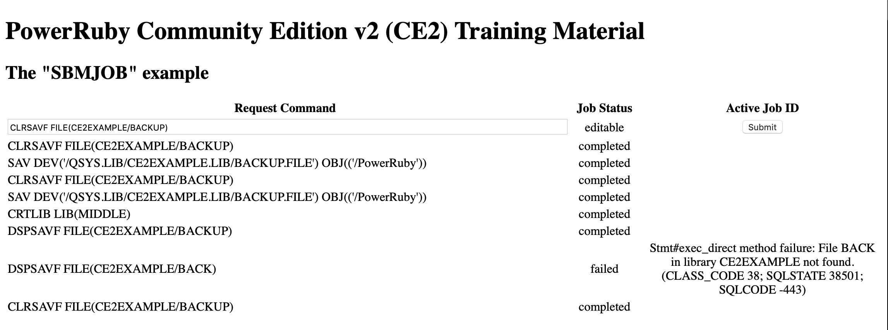

# Training Material for PowerRuby Community Edition v2


As announced in our previous example this training project will integrate the ability to push content from the server side (via Action Cable) with the Active Job framework (i.e. the ability to "submit" Rails jobs).

We will also trigger these submissions from the web graphical user interface provided by our skeleton application.

**Note:** please refer to **DE\_train\_03** and **DE\_train\_04** projects for the basics of **Action Cable** and **Active Job** respectively.

## Architecture

In **DE\_train\_03** we have shown how to refresh the DOM in the browser with server-push actions. This is possible because of **Action Cable** but it is not the only functionality offered by this WebSocket-based framework. 

In this project we will also leverage the ability to activate actions on the web server triggered by events in the user interface **without page reloads** (i.e. without involving **HTTP verbs**). The Web developments offered by this technique are usually labeled **SPAs** for **Single-Page Applications** and much of the activity occurs on the client-side. 

Instead of using AJAX we completely found our SPA-style on the JavaScript librararies executing in the browser glued together by the Rails Action Cable framework. Please note that this field is in permanent transformation: we will use a bit of **CoffeeScript** code because PowerRuby CE2 is based on Rails 5.1 but the evolution is towards a [Decaffeinated Rails](https://github.com/rails/rails/pull/34177). 

For the sake of simplicity we will ignore the problem of establishing an exclusive channel between each browser session and the server (this functionality will be addressed in a future training application). This means that in this training project all the browsers having an active subsctiption to the same Action Cable channel will receive the effects of the services triggered on the server side (we will **broadcast** results to all subscribers).

## The graphical user interface

First of all we have to design a simple user interface that will support our logic. 

We would like to temporarily keep track of our requests **without** any recording in DB2 tables: we will use the local DOM instead. The interface should allow us to logically relate DOM elements created at submission time with information received back from the server when requests have been served by the Active Job component.

This means there will be: 

* a short-term cycle (the *enqueueing phase*) where we will be allowed to store an Active Job identifier in the DOM element created for the request;
* a longer-term cycle (the *completion phase*) where server-side events will notify that specific Active Jobs have been performed: we will be able to correlate completions with DOM elements by means of the Active Job identifiers.

As with previous projects you can follow the development stages by means of the git commits of the project.

So, let's start our journey! 

## jQuery table plug-in?
  
In order to rapidly implement an interface for our application we could have leveraged jQuery table plug-ins that can simplify our development, we could have adopted Bootstrap instead, or another fancy JS framework. 

Decisions about JavaScript libraries to adopt are not straightforward.

We opted to implement a rudimentary architecture on top of the HTML **table** structure. This **DIY approach** (Do-It-Yourself) could be useful in your training but it is definetely not a good idea in any serious development project: but the focus here is on Rails jobs creation, submission and tracking so forget a rich graphical user interface.

## HTML table

Our `index.html.erb` is still very basic. At this stage of the development we inserted some presentation annotations that should be (more correctly) located in the Cascading Style Sheets:

```html                                              
<h1>PowerRuby Community Edition v2 (CE2) Training Material</h1>                            
<h2>The "SBMJOB" example</h2>                                                              
                                                                                           
<table id="events" style="width:100%">                                                     
  <tr>                                                                                     
    <th>Request Command</th>                                                               
    <th>Job Status</th>                                                                    
    <th>Active Job ID</th>                                                                 
  </tr>                                                                                    
  <tr>                                                                                     
    <td><input type="text" id="command" style="width:100%"/></td>                          
    <td align="center" style="width:100px">editable</td>                                   
    <td align="center" style="width:300px"><button id="add_row_btn">Submit</button></td>   
  </tr>                                                                                    
</table>                                                                                                                                  
```

The table has its own **id** (`events`). After a table heading row we inserted a static row including three cells; two of them have a special meaning:

* one will provide the input for the command we want to execute on the server side 
* the other is the button to submit the command.

All the following HTML **tr** elements will be added by JavaScript logic.

We will create new rows when a command has been submitted. 
As soon as we want to refine the informations contained in the rows once submitted jobs complete we will assign these tr elements a unique **id**: the Active Job id.

As soon as this id will be assigned on the server we will add the new record only on return of the execution of a function invoked on the server-side.  



## page CoffeeScript

The specific page that will appear as index is enriched with a bit of JavaScript logic.

```javascript
(function() {
  $(function() {
    return $('#add_row_btn').click(function(event) {
      return App.web_events.sbmjob($('#command').val());
    });
  });
}).call(this);
```

The `$(#add_row_btn)` call returns the DOM object labeled with the **id** `add_row_btn`.
This is a shortened equivalent of JavaScript `document.getElementById("add_row_btn")`.

The point is that **jQuery** uses the `$(selector).action()` syntax and `selector` adheres precisely to **CSS** syntax where `#` sign stands for **id**.

The tricky aspect is that, although jQuery reduces JavaScript verbosity, Rails is not using JavaScript directly but CoffeScript. This means that the actual code to obtain the JavaScript we have shown is the following CoffeeScript source fragment:

```coffeescript
$ ->                                            
  $('#add_row_btn').click (event) ->            
    App.web_events.sbmjob($('#command').val())  
```

When the button we created in the second row of our table gets pressed (`click`) the JavaScript function `sbmjob` gets called passing as argument the current content of the input field labeled with id `command`. 

But where we defined the `sbmjob()` fuction?

## web\_events CoffeeScript

There is a general CoffeeScript file being generated when we created the Action Cable channel. This JavaScript creates an Action Cable subscription to **WebEventsChannel** passing a hash of functions. Three of these functions are always initialized (empty) by the `generate channel` Rails command.
They are: **connected**, **disconnected**, **received**.  

But we can initialize extra functions: we added the `sbmjob` one. This is the JavaScript generated

```javascript
    sbmjob: function(data) {
      return this.perform('sbmjob', {
        command: data
      });
    }
```

by this CoffeeScript:

```coffescript
  sbmjob: (data) ->                        
    @perform 'sbmjob', command: data       
```

It is clear that `perform` is provided by Action Cable JavaScript framework (you can actually inspect the source code from your browser JavaScript tools).

We understood that when our *Submit* button gets pressed Action Cable invokes a Ruby function on the server side named **sbmjob** (*Convention-over-Configuration* rules!) 

## web\_events\_channel Ruby

When JavaScript creates an Action Cable subscription the name being passes is actually the name of a Ruby class inheriting from `ApplicationCable::Channel` class:

```ruby
class WebEventsChannel < ApplicationCable::Channel                                                                      
  def subscribed                                                                                                        
    stream_from "web_events_channel"                                                                                    
  end                                                                                                                   
                                                                                                                        
  def unsubscribed                                                                                                      
  end                                                                                                                   
                                                                                                                        
  def sbmjob(data)                                                                                                      
    CleverUtilityJob.perform_later(data['command'])                                                               
  end                                                                                                                   
end                                                                                                                     
```

The `WebEventsChannel` class includes a `sbmjob` method that receives the hash prepared by JavaScript. The current command needs to be referenced with  `data['command']` and that is the value passed to the **perform_later** method of the `CleverUtilityJob` class.

## clever\_utility\_job Ruby 

The heart of our job definition is the **perform** method. 

```ruby
  def perform(*args)                                          
    logger.info "Executing Job with arguments: #{args}"       
    l = args[0].size                                          
    c = ActiveRecord::Base.connection                         
    escaped_cmd = args[0].gsub("'", "''")                     
    @status = 'completed'                                     
    begin                                                     
      c.execute("CALL QCMDEXC('#{escaped_cmd}', #{l})")       
    rescue Exception => e                                     
      @status = 'failed'                                      
      @msg = "#{e}"                                           
    end                                                       
  end                                                         
```

By means of the DB2 driver we are able to call native IBM i commands. This example is **by definition** dangerous but it is showcasing the potentiality of PowerRuby.

We included the actual execution inside a block where we are allowed to "monitor" for exceptions and store status and exception message in instance variables (`@`) created on the fly.

In the same Active Job class we can define two **callback** methods.

We defined the **after_enqueue**: the callback that gets called when the job is enqueued:

```ruby
  after_enqueue do |job|                                                                                                     
    ActionCable.server.broadcast 'web_events_channel', job_id: job.job_id, request: arguments[0], status: 'waiting'          
  end                                                                                                                                                                                                                          
``` 

and the **after_perform** callback: the one that gets called when the job completes:

```ruby
  after_perform do |job|                                                                                 
    ActionCable.server.broadcast 'web_events_channel', job_id: job.job_id, status: @status, jobret: @msg 
  end                                                                                                    
``` 

So we broadcasting twice for each job.


## multiple broadcasts different handling

For the same job we are receiving two broadcasts: 

* when the job is enqueued
* when the job completes  

Each broadcast will trigger the same JavaScript function (**received**) at the client side. 
We are showing here the CoffeScript source of it:

```coffeescript
received: (data) ->                                                                        
  request_selector = '#' + data['job_id'] + ' > td.request'                                
  status_selector  = '#' + data['job_id'] + ' > td.status'                                 
  jobret_selector  = '#' + data['job_id'] + ' > td.jobret'                                 
  request = $('#events').find(request_selector).html()                                     
  if not request                                                                           
    $('#events').append '<tr id="'                 + data['job_id']  + '">' +              
             '<td class="request">'                + data['request'] + '</td>' +           
             '<td class="status" align="center">'  + data['status']  + '</td>' +           
             '<td class="jobret" align="center">'  + data['job_id']  + '</td></tr>'        
  else                                                                                     
    $('#events').find(status_selector).html(data['status'])                                
    $('#events').find(jobret_selector).html(data['jobret'])                                
```

First we prepare 3 composite (CSS) selectors. 

The selector `request_selector` searches for a DOM element with the specified id (`#`).
Then among its children looks for a **td** DOM element of class **request** (`.`).

When a job with the specified Active Job id is not present it will appending the HTML to the table object. Otherwise it will update the td of class **status** and the td of class **jobret** accordingly.

## Playing with "sbmjob"

Similarly to previous traininig projects you can easily install the project:

```
                    Simplify usage of Rails new (RAILSNEW)             
                                                                       
Immettere le scelte e premere Invio.                                   
                                                                       
New Rails Application Name . . . > TrainMeOnPowerRuby                  
Apache HTTP Instance . . . . . . > SBMJOB        Character value       
Apache Instance Port . . . . . . > 12345         Number                
Ruby Web Server Port . . . . . . > 54321         Number                
Creation mode  . . . . . . . . . > *GITHUB       *NEW, *NONE, *GITHUB  
GitHub: username . . . . . . . .                                       
GitHub: password . . . . . . . .                                       
GitHub: PowerRuby: project . . .   'DE_train_05'  
                     
```

Then stop the services started:

```
ENDTCPSVR SERVER(*HTTP) HTTPSVR(SBMJOB) 
POWER_RUBY/RAILSSVR ACTION(*END) APP('/www/SBMJOB/htdocs/TrainMeOnPowerRuby/current') 
```

Uncomment the WebSocket Tunneling options needed by Action Cable (see project **DE\_train\_03** for details):

```
##                                                                             
## PowerRuby                                                                   
##                                                                             
 LoadModule proxy_module /QSYS.LIB/QHTTPSVR.LIB/QZSRCORE.SRVPGM                
 LoadModule proxy_ftp_module /QSYS.LIB/QHTTPSVR.LIB/QZSRCORE.SRVPGM            
 LoadModule proxy_http_module /QSYS.LIB/QHTTPSVR.LIB/QZSRCORE.SRVPGM           
 LoadModule proxy_connect_module /QSYS.LIB/QHTTPSVR.LIB/QZSRCORE.SRVPGM        
 LoadModule proxy_wstunnel_module /QSYS.LIB/QHTTPSVR.LIB/QZSRCORE.SRVPGM       
 Listen *:12345                                                                
 DocumentRoot /www/SBMJOB/htdocs/TrainMeOnPowerRuby/current/public             
 ProxyPass /cable ws://127.0.0.1:54321/cable                                   
 ProxyPass / http://127.0.0.1:54321/                                           
 ProxyPassReverse / http://127.0.0.1:54321/                                    
```

Verify that **Redis** server is running, start **Sidekiq** as in project **DE\_train\_04**, then restart the services:

```
POWER_RUBY/RAILSSVR ACTION(*START) APP('/www/SBMJOB/htdocs/TrainMeOnPowerRuby/current') VRM(*V24) PORT(54321)
STRTCPSVR SERVER(*HTTP) HTTPSVR(SBMJOB) 
```

You can now play (and study) this new application by experimenting this peculiar remote commanding:



You can continue editing new command lines to submit. Issued commands will appear in **waiting** status and will end up into **completed** or **failed** status. 
While waiting the Active Job Id will be visible in the third column, on completion it will be cleared or an error message will be visible because of a failure.

If a job is blocking the execution it is possible you will find a QSQSERV job in message waiting (the user profile is the one that sumbitted Sidekiq server).


There are a few tricky source details to note:

* the IBM i commands can include single quoted parameters that are handled with a global substitution (**gsub**) not to be considered in the total length passed to **QCMDEXEC**

```
  def perform(*args)                                          
    . . .
    l = args[0].size
    . . .                                          
    escaped_cmd = args[0].gsub("'", "''")   
    . . .                  
      c.execute("CALL QCMDEXC('#{escaped_cmd}', #{l})")   
    . . .      
  end                                                         
```

* the *after_enqueue* callback uses **arguments[0]** to have access to the first parameter passed on the perform:

```ruby
    ActionCable.server.broadcast 'web_events_channel', job_id: job.job_id, request: arguments[0], status: 'waiting'          
``` 

* when a long running command has been submitted (e.g. SAV) we can submit new ones that will be **waiting**  
